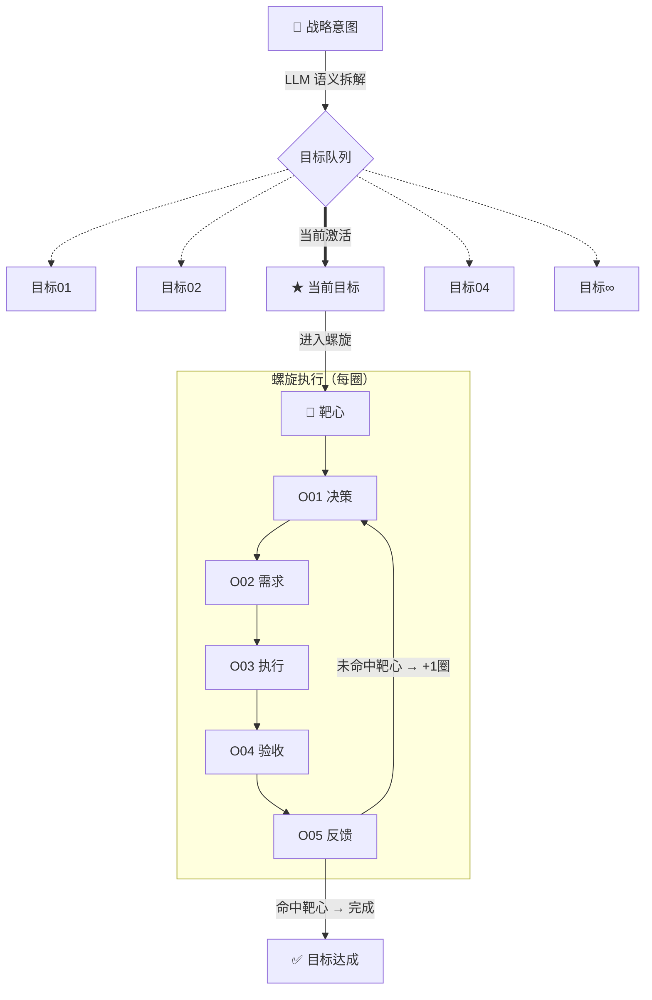
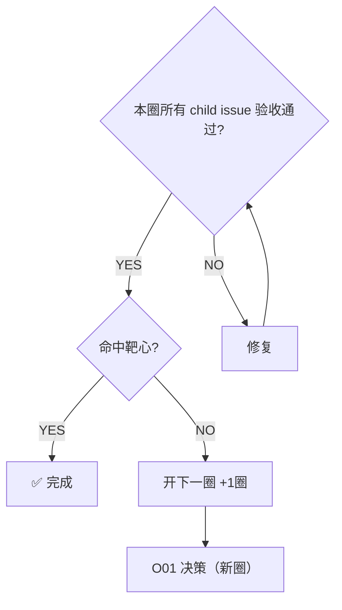

# 需求陈述

> 每次启动新目标前填这里。填不上的格子 = idea 还没想清楚的地方，先补清楚再往下走。

```
用户是谁：

现在怎么解决（基线/现状）：

我的方案和现状的核心差异：

什么叫"做完了"（可交付）：

什么叫"做对了"（成功标准）：

已知的约束/边界：
```

---

# 螺旋执行协议

## 完整架构



## 五节点定义

| 节点 | 编号 | 职责 | 产出物 |
|------|------|------|--------|
| 决策 | O01 | 定义本圈靶心和边界 | master issue |
| 需求 | O02 | 拆解 child issue，定义 AC/DoD | child issues |
| 执行 | O03 | Cursor 并行执行 | PR / 代码变更 |
| 验收 | O04 | T1/T2/T3 验收，关单 | verified issues |
| 反馈 | O05 | 复盘，决定是否升圈 | retro comment |

## 升圈规则



## 每圈只做加法

- 新圈建立在上一圈基础上，不推翻已验收的 issue
- 靶心可随业务理解深化微调，但方向不变
- 战略意图分解出的目标队列，每次只激活一个进入螺旋
